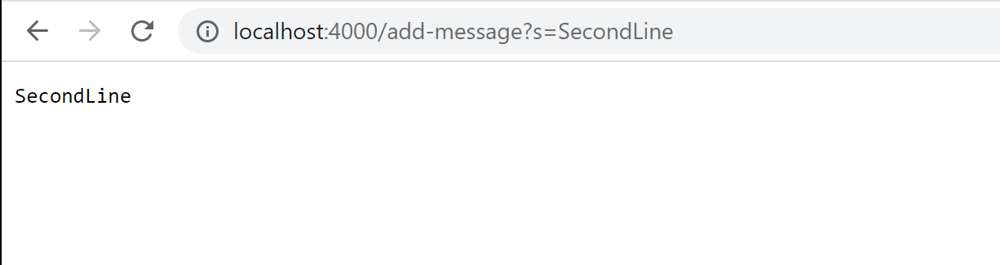

# Lab Report 2

# Part 1
The following is my code for StringServer.java:
.png)
I used the Server.java file from the Week 2 Lab as part of setting up the server. I also used the NumberServer.java 
file from the Week 2 Lab for examples for URI methods and writing the StringServer main method.

The following screenshot shows the website with the given query string in the URL being “FirstLine”. When I went to 
the website (entered the URL), the main method of StringServer was called. The field was String[] args, which had a 
value which was the URL, which was [http://localhost:4000/add-message?s=FirstLine]http://localhost:4000/add-message?s=FirstLine.
```
public static void main (String[] args) throws IOException {...}
```
Since `args.length == 0` is false, the body of the if statement is skipped. 
```
if(args.length == 0){...}
```
The field `int port` is found by using the `parseInt()` method, and the value is 4000. A new instance of `Server` is instantiated and
the `start()` method is called, with the value of 4000 for the `port` field, and a new `Handler()` instance being created for the `URLHandler` field.
```
int port = Integer.parseInt(args[0]);

Server.start(port, new Handler());
```
Then, the method `handleRequest()` is called, with the URL being the value for the `url` field.
```
public String handleRequest(URI url) {...}
```
Since `url.getPath().equals(“/”)` is not true, the body of the if statement is skipped.
Since `url.getPath().contains(“/add-message”)` is true, the if statement body is executed. `url.getQuery().split(“=”)` is used to 
assign the URL (split on the “=” character) to a String array called `parameters`. In the `parameters` array, the first element is the “s” 
from the URL, and the second element is the given query string, “FirstLine” in this instance. Then, `String.format(parameters[1] + “\n”)` 
is returned, which prints the given query string (“FirstLine”) and a new line on the webpage.

The following screenshot shows the website with the given query string in the URL being “SecondLine” (I am aware this 
output is incorrect, corrections to the code are made in Part 2). Most of the code execution is the same as the first input except 
for the last few lines. When I went to the website (entered the URL), the main method of StringServer was called, and the same lines 
executed. Then `handleRequest()` is called, with most of the lines executing with the same results. Then `url.getQuery().split(“=”)` 
is used to assign the URL (split on the “=” character) to a String array called `parameters`. In the `parameters` array, the first 
element is the “s” from the URL, and the second element is the given query string, “SecondLine” in this instance. Then, 
`String.format(parameters[1] + “\n”)` is returned, which prints the given query string (“SecondLine”) and a new line on the webpage. 
The output is incorrect. The expected output is “FirstLine” + “\n” + “SecondLine”, but instead, only “SecondLine” is printed when the 
second input is given.


# Part 2
For this part, unfortunately, I was having trouble with using the assertEquals() method on for the JUnit tests. When I was using the 
`handleRequest()` method for the actual value in the `assertEquals()` method, I kept getting an error saying I couldn’t “make a static 
reference to the non-static method handleRequest(URI url)”. I will try to figure it out by asking the professor or TA’s, and resubmitting 
the lab report. However, for now, I’ll just be entering the URL (the input) to the server, and taking screenshots of the printed statements 
(the output) to check for bug symptoms and fixes.

* Failure-inducing test 1: The screenshots I showed in Part 1 are already a case of a bug. Two URI inputs with two valid query strings were 
given. The expected output (after the two inputs are given) is that the first input string followed by the second input string on the next line 
should be printed. The first output was correct, as it printed the first given query string. The bug symptom was that only the second string 
was printed after the second URI input was given.
* Failure-inducing test 2: For this test, I used two URI inputs, one with a valid query string, and a second without one 
(meaning `getPath() = “/”`). The expected output (after the two inputs were given) was that the first input string should be printed. The first 
output was correct, as it printed the first given query string. The symptom was that nothing was printed after the second URI input was given.

* No-failure test: For this test, I used one URI input, one with a valid query string. The expected output was that the input string should be 
printed. The actual output was the same as the expected.


* Code before fixes:
```
public String handleRequest(URI url) {
    if (url.getPath().equals("/")) {
        return "";
    }
    else if (url.getPath().contains("/add-message")) {
        String[] parameters = url.getQuery().split("=");
        return String.format(parameters[1] + "\n");
    }
```
* Code after fixes:
```
String strTotal = "";

public String handleRequest(URI url) {
    if (url.getPath().equals("/")) {
        return "";
    }
    else if (url.getPath().contains("/add-message")) {
        String[] parameters = url.getQuery().split("=");
        strTotal = strTotal + parameters[1] + "\n";
        return String.format(strTotal);
    }
```
The main change I made was creating a new String variable called `strTotal` that additional query strings could be concatenated 
to. Due to making this change, I also had to change the body of the else-if statement. I added a line to modify `strTotal` and 
edited the line to return it.

# Part 3
One thing I learned from the past few weeks is how the student’s definition of a working program differs from the professional definition. 
The student definition only requires that the program exhibits correct I/O most of the time. Technically, this can be sufficient enough to 
accomplish the assigned task.


