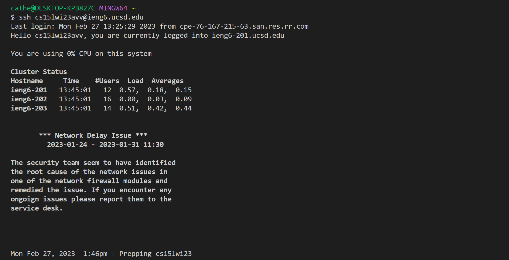
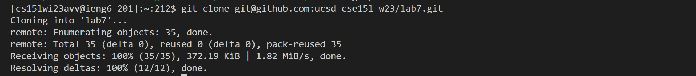
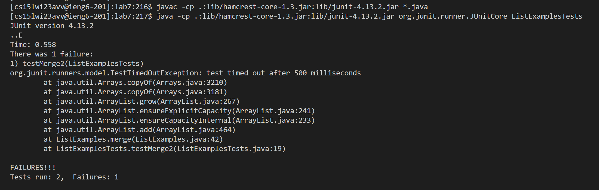
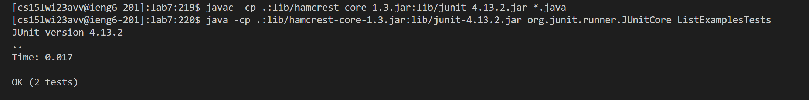

# Lab Report 4
## Challenge Task Procedure
## Step 4: Log into ieng6

Type: `ssh cs15lwi23avv@ieng6.ucsd.edu <enter>`
* This logs into the ieng6 account on a remote computer.
## Step 5: Clone your fork of the repository from your Github account

* The SSH key can also be found at the GitHub repository link [https://github.com/catllian/lab7](https://github.com/catllian/lab7) in your browser. Go to the "Code" dropdown, then the "Local" section, then the "SSH" section. Click on the button to copy the SSH key.

Type: `git clone <Ctrl + V><enter>`

(To clarify, the command that was entered was `git clone git@github.com:catllian/lab7.git`).

* This clones the repository fork from the GitHub account into the remote computer.
## Step 6: Run the tests, demonstrating that they fail

* The compile command can be found on the Week 3 webpage of the CSE 15L website at the link [https://ucsd-cse15l-w23.github.io/week/week3/](https://ucsd-cse15l-w23.github.io/week/week3/) in your browser. Go to the "Lab Tasks" section, then the "Setup" section, and it will be under "MAC USERS:". Use <Ctrl + C> to copy the compile command.

Type: `<Ctrl + V><enter>`

(To clarify, the command that was entered was `javac -cp .:lib/hamcrest-core-1.3.jar:lib/junit-4.13.2.jar *.java`).

* The <Ctrl + V> pastes the compile command, and it is executed. This compiles the Java and JUnit library files.
* Part of the run command can be found on the Week 3 webpage of the CSE 15L website at the link [https://ucsd-cse15l-w23.github.io/week/week3/](https://ucsd-cse15l-w23.github.io/week/week3/) in your browser. Go to the "Lab Tasks" section, then the "Setup" section, and it will be under "MAC USERS:". Use <Ctrl + C> to copy the run command.

Type: `<Ctrl + V><Ctrl + W> ListExamplesTests <enter>`

(To clarify, the command that was entered was `java -cp .:lib/hamcrest-core-1.3.jar:lib/junit-4.13.2.jar org.junit.runner.JUnitCore ListExamplesTests`).

* The <Ctrl + V> pastes the run command. <Ctrl + W> deletes the last word, because the original command was meant to apply to `ArrayTests`. Then `ListExamplesTests` is specified as the file to run. This runs ListExamplesTests. The output is 1 failure because the ListExamples.java file has bugs.
## Step 7: Edit the code file to fix the failing test
.png)
.png)
Type: `nano L<tab>.java <enter>`

(To clarify, the command that was entered was `nano ListExamples.java`).

* The <tab> helps by autocompleting the "L" to "ListExamples". The command opens nano to edit ListExamples.java.

.png)
Type: `<Ctrl + W> while(index2 <enter>`
* The <Ctrl + W> opens the search bar to find the phrase `while(index2` in the code, and helps by moving the cursor closer to the location of the bug.

.png)
Type: `<down><down><right><right><right><right><right><right><right><right><backspace> 2`, then `<Ctrl + O><enter><Ctrl + W>`
* The first command goes to the exact location of the bug, deletes it, and replaces it with the correct character `2`. The next command writes out the edit, confirms it will be written out to ListExamples.java, and then exits the nano editor.
## Step 8: Run the tests, demonstrating that they now succeed

Type: `<up><up><up><enter>`

(To clarify, the command that was entered was `javac -cp .:lib/hamcrest-core-1.3.jar:lib/junit-4.13.2.jar *.java`).
* This uses the up key to go through the history of commands to find the compile command used in Step 6 and executes it. This compiles the Java and Junit library files.

Type: `<up><up><up><enter>`

(To clarify, the command that was entered was `java -cp .:lib/hamcrest-core-1.3.jar:lib/junit-4.13.2.jar org.junit.runner.JUnitCore ListExamplesTests`).
* This uses the up key to go through the history of commands to find the run command used in Step 6. The command is executed and this runs ListExamplesTests. As seen in the screenshot, the tests were successful, meaning the bug was fixed.
## Step 9: Commit and push the resulting change to your Github account (you can pick any commit message!)
.png)
Type: `git add ListExamples.java <enter>`, then `git commit -m "ListExamples.java updated" <enter>`
* The first command tracks the changes to the ListExamples.java, and the next one makes a commit with given message.
.png)
Type: `git push origin main <enter>`
* The command pushes the commit to the main branch of the given origin, which is the lab7 repository on my GitHub account.
