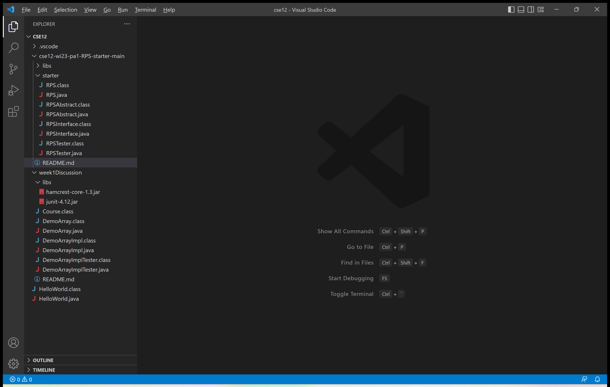
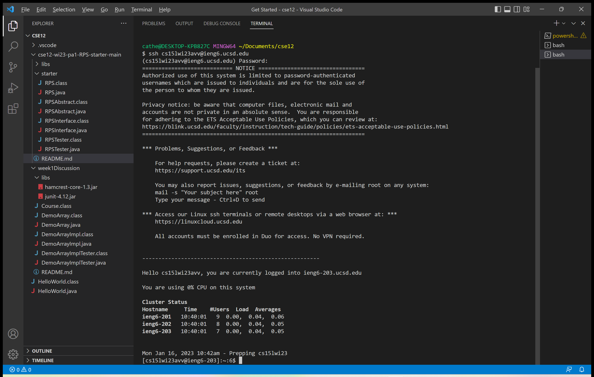
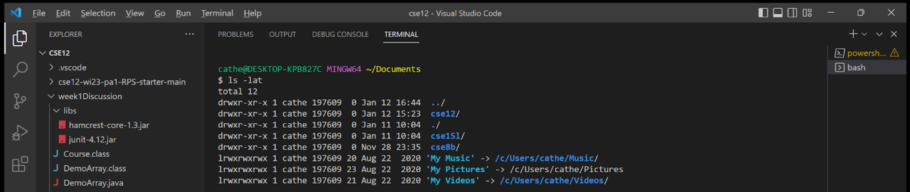
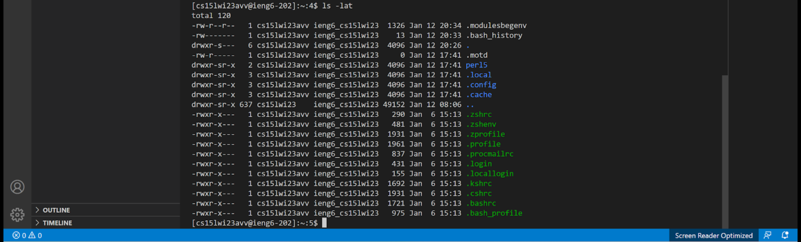

# Week 1 Lab Report

# Installing VSCode
If you choose not to download Visual Studio Code for your personal computer, you can choose to use 
the program on the lab computers, and can skip this section.

If you are going to download VS Code for your personal computer, then you will go to this link 
[https://code.visualstudio.com/](https://code.visualstudio.com/). You will download the setup for 
your specific operating system. You can keep the default choices for the setup when installing. When 
VSCode is open, it should look like this:


# Remotely Connecting
These steps are about how to connect to a remote computer using VS Code or a terminal.
1. Install git for Windows. The link is [https://gitforwindows.org/](https://gitforwindows.org/).
2. To have the default terminal use `git bash`, first open the terminal by pressing Ctrl + `. Press
Ctrl + Shift + P to open the command palette. Type "Select Default Profile", and select Git Bash. 
Then click "+" in the terminal window, the terminal will now be Git Bash.
3. Open the terminal, and type in the following command: `ssh cs15lwi23zzz@ieng6.ucsd.edu`. The "zzz"
will be the specific characters from your course account.
4. You will then see something like the following message. Type the command `yes` to the question.
```
⤇ ssh cs15lwi23zzz@ieng6.ucsd.edu
The authenticity of host 'ieng6.ucsd.edu (128.54.70.227)' can't be established.
RSA key fingerprint is SHA256:ksruYwhnYH+sySHnHAtLUHngrPEyZTDl/1x99wUQcec.
Are you sure you want to continue connecting (yes/no/[fingerprint])?
```
5. There will be a line like the following asking for the password. Type in the password
and enter (even though it does not show up when it is being typed, it is still being typed).
```
(cs15lwi23zzz@ieng6.ucsd.edu) Password:
```
6. After successfully connecting to the remote server, your terminal should look like this:


# Trying Some Commands
After connecting, try some commands, both on your computer and on the remote server. Example commands:
* `cd` - changes the working directory, variation `cd ~`
* `ls` - lists files and folders for the path, variations `ls -lat`, `ls -a`, `ls <directory>`
* `pwd` - prints the working directory
* `mkdir` - creates a new directory with the pathname
* `cp` - specifies classpath to search for classfiles in
* `cat` - prints the contents of the files at the given paths
The following are examples where I tried the command `ls -lat`, the first screenshot is for the command 
done on my computer and the second is for the one done on the remote server.


